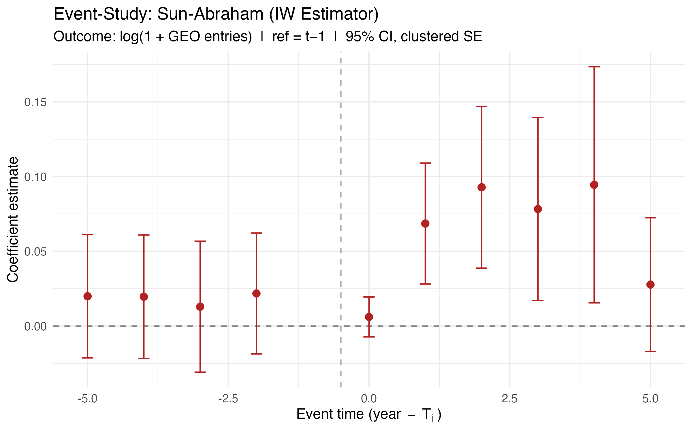
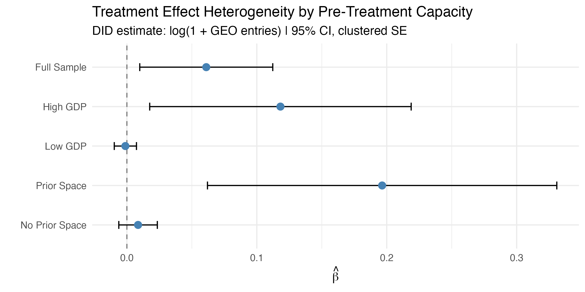

# Rivalry, Capacity, and GEO Activity

**Does geopolitical rivalry push states into geostationary orbit — or does it only accelerate states that could already get there?**

Replication materials for my MA thesis (University of Chicago, MAPSS, 2026). The paper builds a 176-country annual panel covering 1963–2024, defines treatment as a discrete jump in the geostationary presence of a country's strategic rivals, and estimates a staggered difference-in-differences design on the intensive margin of GEO activity.

The short answer: **rivalry amplifies, it does not create.** A rival-pressure shock raises annual GEO entries by about 6% on average, but essentially all of that effect is concentrated in countries that already had orbital capability. On the extensive margin — the decision to enter GEO for the *first* time — rivalry adds almost nothing once industrial capacity and population are controlled for.

---

## Main results

| | Estimate | SE | p |
|---|---|---|---|
| TWFE DID (baseline) | 0.0611 | 0.0261 | 0.021 |
| Sun–Abraham interaction-weighted | 0.0614 | 0.0360 | 0.089 |
| Subsample: countries with prior GEO activity | 0.191 | 0.093 | 0.067 |
| Subsample: countries without | 0.021 | 0.011 | 0.074 |

Outcome is `log(1 + GEO entries)`; both specifications carry country and year fixed effects with standard errors clustered by country. Sample: 8,211 country-years, 29 treated countries, 143 never-treated controls, 1970–2020.

<table>
<tr>
<td width="50%"></td>
<td width="50%"></td>
</tr>
<tr>
<td><em>Dynamic effects, Sun–Abraham interaction-weighted estimator. Pre-treatment coefficients are jointly indistinguishable from zero (χ²(4) = 0.66, p = 0.999); the response builds over t+2 to t+4, consistent with multi-year satellite procurement cycles.</em></td>
<td><em>The average effect is almost entirely driven by countries with pre-existing orbital capability — the paper's central claim.</em></td>
</tr>
</table>

The design is stress-tested five ways: a Goodman-Bacon decomposition of the TWFE weights, a Sun–Abraham correction for the forbidden-comparison problem, a 1,000-draw permutation placebo (p ≈ 0.02), leave-one-cohort-out, and sensitivity to the treatment threshold. See `output/figures/`.

---

## What is in here

```
code/
  00_setup.R              paths, packages, and build_did_sample() — the single
                          source of truth for treatment assignment
  run_all.R               reproduces every table and figure from the panel
  01_build/               panel construction from third-party sources
  02_analysis/            the results reported in the paper
  03_exploratory/         specification searches and QA checks (see note below)
data/
  derived/                the estimation panel (tracked) + codebook
  raw/                    third-party sources (not redistributed; see data/README.md)
output/figures/           every figure in the paper
output/tables/            regression output
paper/                    thesis.pdf and its LaTeX source
```

### Analysis scripts

| Script | Produces |
|---|---|
| `02_analysis/20_summary_stats.R` | Table 1 |
| `02_analysis/21_baseline_ols.do` | Table 2 — descriptive OLS with year FE (Stata) |
| `02_analysis/22_did_twfe_sunabraham.R` | Table 3, Figures 1 and 5 — TWFE vs Sun–Abraham |
| `02_analysis/23_robustness.R` | Figures 2, 3, 4, 6, 7 — cohorts, Bacon, placebo, heterogeneity, LOCO, threshold |
| `02_analysis/25_cox_survival.do` | Appendix E Cox table (Stata) |
| `02_analysis/26_cox_survival.R` | Appendix E, R port with survival figures |
| `02_analysis/27_cox_appendix_figs.R` | Appendix E concordance and GDP-split figures |

## Reproducing

```bash
git clone https://github.com/yidongyangcn-creator/space-geo-rivalry.git
cd space-geo-rivalry
Rscript code/run_all.R
```

`run_all.R` starts from `data/derived/panel_country_year.csv`, which is tracked in this repository, so a fresh clone reproduces every result without downloading anything. Rebuilding that panel from the original sources is a separate step — see `data/README.md`.

Tested with R 4.3. Required: `readr`, `dplyr`, `tidyr`, `stringr`, `slider`, `ggplot2`, `fixest` (≥ 0.11), `survival`, `broom`, `scales`. Optional: `bacondecomp` (Goodman-Bacon figure), `purrr`. The two `.do` files need Stata with `estout` and `outreg2`.

## A note on `code/03_exploratory/`

This directory is a record, not a result. It contains the grid searches over treatment definitions, outcome transformations and estimation windows that preceded the reported specification, along with the synthetic-control case studies that did not make the paper and the QA scripts used while building the panel. It is committed for transparency about the specification search. Nothing in the paper depends on it.

## Data sources

GCAT (McDowell), Strategic Rivalry data (Colaresi, Rasler and Thompson), V-Dem v15, World Bank WDI, and Correlates of War alliance data. Full citations, versions and download instructions are in `data/README.md`.

## Citation

Yang, Yidong (2026). *Rivalry, Capacity, and GEO Activity: Evidence from a Staggered Difference-in-Differences Design.* MA thesis, University of Chicago.

Code is released under the MIT License. The derived panel is redistributed under the terms of its constituent sources; see `data/README.md`.
